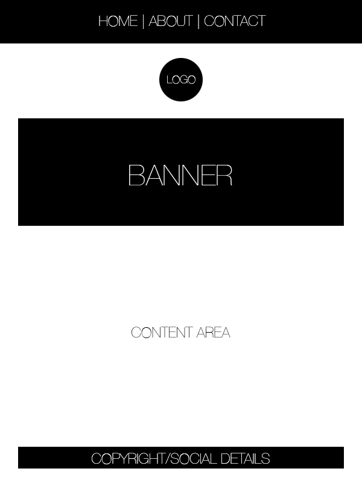

# Assignment-11
## Lisa Yakubowski

1. Padding is the space created between the content and element itself. Margin is the space between the element and other elements. Borders are lines around content.

2. 

3. For this project I had a quick idea of what I wanted to do in mind. Making the layout was the first step, and proved invaluable to reference back to in order to stick to my vision for my site. 
